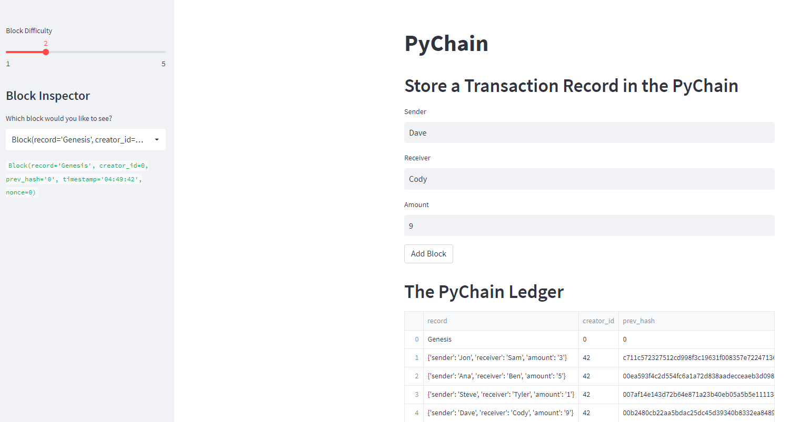
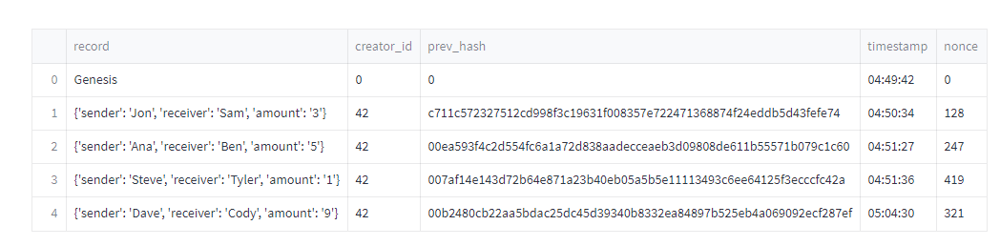

# Challenge_18_Blockchain

## Instructions

Test your complete `PyChain` ledger and user interface by running your
Streamlit application and storing some mined blocks in your `PyChain` ledger.
Then test the blockchain validation process by using your `PyChain` ledger.
To do so, complete the following steps:

1. In the terminal, navigate to the project folder where you've coded the
 Challenge.

2. In the terminal, run the Streamlit application by
using `streamlit run pychain.py`.

3. Enter values for the sender, receiver, and amount, and then click the "Add
Block" button. Do this several times to store several blocks in the ledger.

4. Verify the block contents and hashes in the Streamlit drop-down menu.
Take a screenshot of the Streamlit application page, which should detail a
blockchain that consists of multiple blocks. Include the screenshot in the
`README.md` file for your Challenge repository.

5. Test the blockchain validation process by using the web interface.
Take a screenshot of the Streamlit application page, which should indicate
the validity of the blockchain. Include the screenshot in the `README.md`
file for your Challenge repository.

